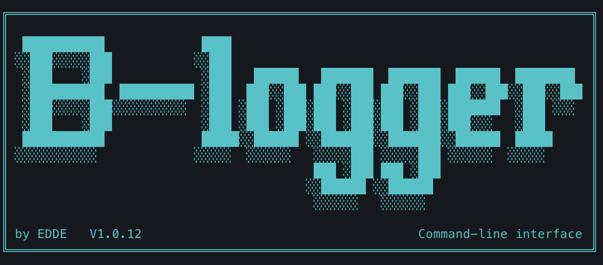

# B-Logger ☕

A retro-style command-line tool for logging your work hours and tasks. Perfect for keeping track of your daily activities with a touch of nostalgia.



## Features

- 📝 Create and manage work logs with timestamps
- ⏱️ Track hours worked on different tasks
- ✅ Mark tasks as completed in multiple systems (other, Jira, etc.)
- 📋 Add subtasks to main tasks
- 📊 View and edit existing logs
- 🧮 Calculate total hours worked per workday
- 📅 Support for custom dates
- ⚙️ Customizable log types and sprint settings
- 📈 Workday-based statistics and reporting
- 🎯 Sprint-based log organization
- 🔄 Migration script management
- 🔗 Important links management

## Installation

1. Clone the repository:
```bash
git clone https://github.com/yourusername/b-logger.git
cd b-logger
```

2. Install the required Python packages:
```bash
pip install -r requirements.txt
```

3. Run the script:
```bash
python b_logger.py
```

## Usage

### Main Menu

1. Logs
2. View current sprint
3. View sprint history
4. Migration script
5. Important Links
6. Settings
7. Help
8. Statistics
9. Exit

### Logs Menu

1. Create log
2. View logs
3. Edit log
4. Delete log
5. Mark as checked
6. Mark as unchecked
7. Edit subtasks
0. Back to main menu

### Migration Script Menu

1. Create migration script
2. View migration scripts
3. Edit migration script
4. Delete migration script
0. Back to main menu

### Important Links Menu

1. Add link
2. View links
3. Edit link
4. Delete link
0. Back to main menu

### Settings

The tool allows you to customize:

- Log Types: Add, edit, or remove different types of logs
  - Each log type can track its own completion status
  - Example: other, Jira, GitHub, etc.
  - Custom prefixes for each type
- Sprint Configuration: Set sprint start date and duration

### How to Input Hours

You can input hours in several formats:
- `1h`        - One hour
- `30m`       - Thirty minutes
- `1h 30m`    - One hour and thirty minutes
- `ongoing`   - For tasks still in progress

### Examples

```
2h        # 2 hours
45m       # 45 minutes
1h 15m    # 1 hour and 15 minutes
2h 30m    # 2 hours and 30 minutes
ongoing   # Task in progress (not counted in totals)
```

### Status Indicators

- ✅ - Task is completed
- ❌ - Task is not completed

Each log type can have its own completion status. For example, a task can be completed in other but not in Jira.

### Migration Scripts

Migration scripts can be managed with the following features:
- Create new migration scripts with ticket number and SQL script
- Track status for:
  - Demo (✅/❌)
  - Stage (✅/❌)
  - Release notes (✅/❌)
- View all migration scripts
- Edit existing scripts
- Delete scripts

### Important Links

The Important Links feature allows you to:
- Store frequently used links (Slack, web links, etc.)
- Add comments to each link
- Track when links were added or modified
- View all stored links
- Edit existing links
- Delete links
- Each link entry includes:
  - Timestamp
  - Link URL
  - Optional comments

### Statistics

The statistics feature provides:
- Data for the last 10 workdays (excluding weekends)
- Completion status for each log type
- Hours worked per workday
- Incomplete tasks by type
- Visual charts for hours and logs per day

### Custom Dates

When creating a new log, you can use a custom date:
- Format: DD.MM.YYYY
- Example: 28.04.2024

### Sprint Features

- View current sprint logs
- View sprint history
- Automatic sprint date calculation
- Distinct ticket tracking
- Sprint duration and start date configuration

### Keyboard Navigation

- Use arrow keys to navigate through input history
- Use backspace to delete characters
- Press Enter to confirm inputs
- Press 0 or type 'exit' to return to previous menu
- Press Ctrl+C to exit the program

## Requirements

- Python 3.6 or higher
- Required packages (see requirements.txt):
  - blessed
  - python-dateutil

## License

This project is licensed under the MIT License - see the LICENSE file for details.

## Contributing

Feel free to submit issues and enhancement requests!
