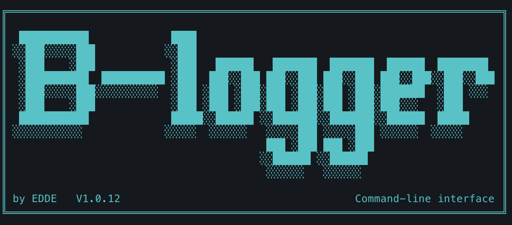

# B-Logger 🍵

Terminal tool for logging work hours and tasks. Track daily work, mark completion across systems (e.g. Jira), manage sprints, migration scripts, and important links.

## Installation

```bash
git clone https://github.com/tinrupcic5/b-logger.git
cd b-logger
pip install -r requirements.txt
python b_logger.py
```

Or use the helper script:

```bash
./run.sh
```

## Requirements

- Python 3.6+
- Packages listed in `requirements.txt` (`blessed`, `python-dateutil`)

## About

- **Author:** Tin
- **Version:** V1.0.12
- **GitHub:** https://github.com/tinrupcic5/b-logger

## License

Edde License. See [LICENSE](LICENSE).

## Contributing

Issues and pull requests are welcome.
